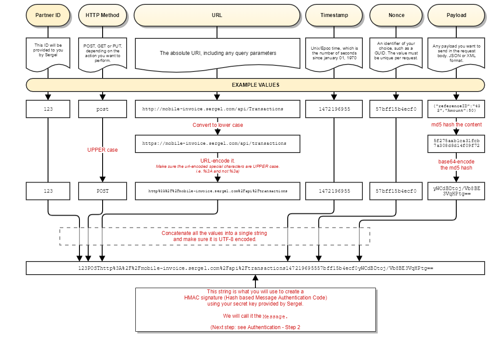
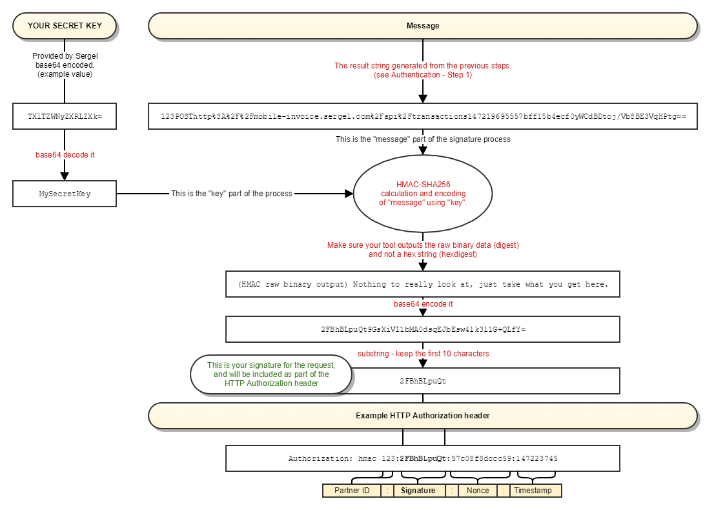

**Mobile Invoice Api - Getting started - creating hmac**

<!-- TOC depthFrom:1 insertAnchor:true -->

- [Step 1 - Generating the string to be signed](#step-1---generating-the-string-to-be-signed)
- [Step 2 - Signing the Message](#step-2---signing-the-message)
- [Step 3 - Compose Authorization header](#step-3---compose-authorization-header)
- [Error Codes](#error-codes)
- [Request-response sample](#request-response-sample)

<!-- /TOC -->

<a id="markdown-step-1---generating-the-string-to-be-signed" name="step-1---generating-the-string-to-be-signed"></a>
## Step 1 - Generating the string to be signed

| Signature parts | Description |
| --------------- | ----------- |
| Partner ID | Provided by Link Mobility |
| HTTP Method | The HTTP Method of the request in upper case. For example "POST", "GET", "PUT" |
| URL | 	The absolute URI of the request, including any query parameters. Lower cased, then URL-encoded. Make sure the special characters of the URL-encoded string are in upper case. For example %3A, not %3a. |
| Timestamp | UNIX time, the number of seconds since Epoch UTC (January 01, 1970).  For example 1472195737 which corresponds to 2016-08-26T07:15:37+00:00 in ISO-8601. |
| Nonce | An reference identifier of your choice, such as a GUID. Max 50 chacters and must be unique per request. |
| Content | If there is a payload/body on the request, MD5-hash it first and then base64-encode the result. |


``` 
UTF8:
All of the above parts are concatenated into one string. Make sure the resulting string is UTF8 encoded.
```

| Sample message string |
| --------------------- |
| 123POSThttp%3A%2F%2Fmobile-invoice.linkmobility.com%2Fapi%2Ftransactions147219695557bff15b4ecf0yWCdBDtoj/Vb8BE3VqHPtg== |

Figure 1 - Create message string


<a id="markdown-step-2---signing-the-message" name="step-2---signing-the-message"></a>
## Step 2 - Signing the Message
``` 
1. Take the message string created in Step 1
2. Take your private secret key
3. Hash them together using HMAC-SHA256 (choose raw binary output)
4. Base64-encode the result
```

| Sample HMAC signature |
| --------------------- |
| 2FBhBLpuQt9GsXiVI1bMA0dsqEJbEsw4lk3l1G+QLfY= |

<a id="markdown-step-3---compose-authorization-header" name="step-3---compose-authorization-header"></a>
## Step 3 - Compose Authorization header
You concatenate some of the values from Step 1 and the first 10 characters of the signature from Step 2 and add to the Authorization header with the parts separated by : (colon)  in the following order:
| Authorization header parts | Description |
| -------------------------- | ----------- |
| Partner ID | As provided by LinkMobility |
| Signature | The first 10 characters of the HMAC signature created in Step 2. |
| Nonce | Your unique reference ID from Step 1. |
| Timestamp | The same Unix timestamp from Step 1. |


| Sample Authorization header |
| --------------------- |
| Authorization: hmac 123:2FBhBLpuQt:57c08f8dccc59:147223745 |

Figure 2 - Compose Authorization header


<a id="markdown-error-codes" name="error-codes"></a>
## Error Codes

| Code | Result |
| ---- | ------ |
| **401** Hmac timestamp clock-drift too high | The timestamp used to generate the hmac token is too old. It can be max 10 minutes old. |
| **401** Invalid HMAC | The hmac token in the Authorization header has some invalid content. |


<a id="markdown-request-response-sample" name="request-response-sample"></a>
## Request-response sample

Request
```
    
GET /api/campaigns HTTP/1.1
HOST: mobile-invoice.sergel.com
Authorization: hmac "1:95onwB16zB:57c44d452af4e:1472482629"
Content-Type: application/json

```

Response
```
HTTP/1.1 200 OK
Content-Length: 796
Content-Type: application/json; charset=utf-8
...
 
[
    {
        "campaignId":1,
        "returnUrl":"http://dummy",
        "statusCallbackUrl":"http://dummy",
        "smsStatusCallbackUrl":"http://dummy",
        "smsNotificationOriginator":"2012",
        "smsNotificationText":"Hello",
        "smsReceiptText":"Thank you",
        "shortCode":"2012",
        "currency":"NOK"},
        ...
    },
    ...
]

```
