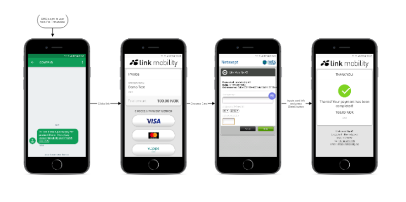

<!-- TOC depthFrom:1 insertAnchor:true -->

- [Common user stories](#common-user-stories)
  - [* Send invoice by sms to users.](#send-invoice-by-sms-to-users)
  - [* Request payment from a Mobile user and allow the user to choose payment method (Phone/SMS or Card).](#request-payment-from-a-mobile-user-and-allow-the-user-to-choose-payment-method-phonesms-or-card)
  - [* Initiate transactions directly when you already know the payment method.](#initiate-transactions-directly-when-you-already-know-the-payment-method)
  - [* See transaction status and billing information.](#see-transaction-status-and-billing-information)
  - [* Define your own callback URL's for receiving status information.](#define-your-own-callback-urls-for-receiving-status-information)
  - [* Define your own URL's for user navigation and landingpages.](#define-your-own-urls-for-user-navigation-and-landingpages)
- [Typical Flow of a Credit Card Payment](#typical-flow-of-a-credit-card-payment)

<!-- /TOC -->

# Common user stories

## * Send invoice by sms to users.

## * Request payment from a Mobile user and allow the user to choose payment method (Phone/SMS or Card).

## * Initiate transactions directly when you already know the payment method.

## * See transaction status and billing information.

## * Define your own callback URL's for receiving status information.

## * Define your own URL's for user navigation and landingpages.

# Typical Flow of a Credit Card Payment

* Invoice is sent to the API
* Sms is sent to user (inclusing link to landing page)
* User opens url (navigates to landing page)
* User selects paymentmethod (from included in the invoice)
* User is redirected to PSP site for payment.
* Payment done - user is redirected to receipt page.

